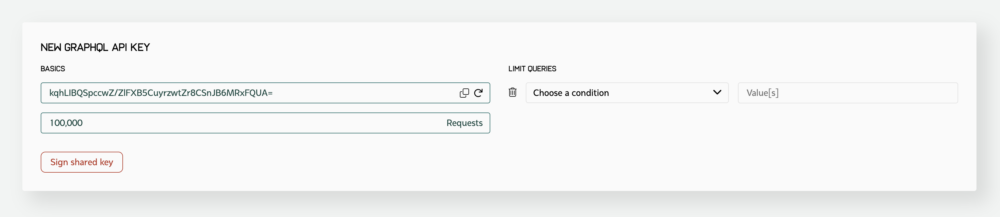

Getting Started
===============

To work with the GraphQL endpoint, you need to use a GraphQL library,
or directly make an HTTP POST request to the Kenshi Deep Index endpoint
for GraphQL. The endpoint address and examples for making GraphQL requests
can be found on the next chapters.

The schema for returned data types, as well as the schema for making requests
to the GraphQL endpoint are also provided. The provided schema can be used in
languages such as Go where an interface is required for unpacking the received
GraphQL data.

To create an API key for querying the GraphQL endpoint, you can head over to
the Kenshi dashboard_, connect your wallet, fill and submit the "New GraphQL API Key"
form.

  New GraphQL API Key form

.. _dashboard: https://kenshi.io/dashboard

How to fill the form?
---------------------

To fill and submit the new GraphQL API key form you can refer to the following manual:

1. **API Key**: You can use the auto-generated API key, auto-generate a new one by pressing
   the small "refresh" button on the field, or by generating and providing your own. The API
   keys are scoped, they're only valid if combined with the address of their owner, in other
   words you'll need to provide your public address as well as this API key for making requests.

2. **Requests**: The number of requests you're expecting to have. This amount does not expire
   by the passing of time, but every successful or unsuccessful call counts as one usage and 
   decreases the remaining possible "requests" by one.

3. **Query limits**: You can add a limit to your API keys, for example you can define an event
   type or a contract address. The API endpoint then is going to throw an error if a query is
   made using this API key that doesn't match the query limits. This field is optional.

.. note::
   Hex values should not be checksumed. All values for query limits should be in lowercase.

Limits
------

The GraphQL endpoint can return maximum 256 records at a time. The maximum processing time for
each request is 5 seconds, and the maximum size of returned data is 1mb.
