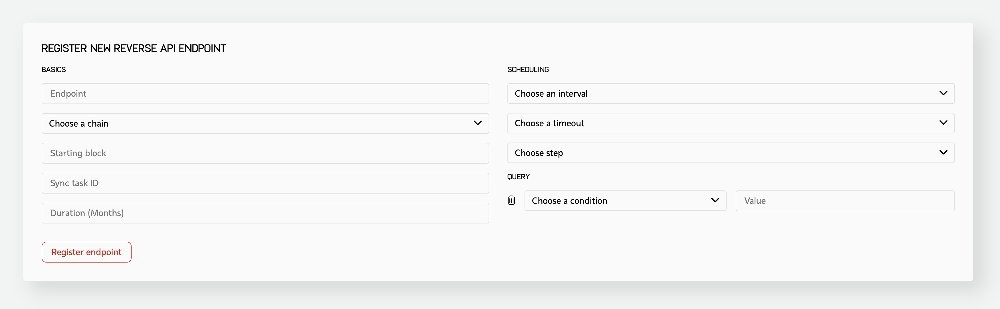

Getting Started
===============

To integrate the Kenshi Reverse-API service into your ecosystem or workflow,
you need to expose an HTTP POST endpoint that is publicly available over the
internet. Once ready, you need to define an event listener task, so the Kenshi
dispatcher can find relevant events for you and notify your endpoint whenever
it finds them. Creating a task and registering your endpoint can be done using
the Kenshi dashboard_.

.. _dashboard: https://kenshi.io/dashboard

  
  New Reverse-API form

How to fill the form?
---------------------

To register a new Reverse-API endpoint you'll need to fill and submit the New Reverse-API form.
You can use the following list as a guide for each of the fields in this form.

1. **Endpoint**: Your Reverse-API endpoint. This endpoint needs to be accessible over the internet.
   This endpoint should accept post requests and return a ``200`` success code on successful receiving
   of the events.

2. **Chain**: The blockchain you are interested in. This is a part of the query that will run against
   the Kenshi blockchain data clusters. This field cannot be modified later.

3. **Starting block**: From which block should we start informing you of the events? You can choose a
   block number in the past if you're looking for historical data. This field cannot be modified later.

4. **Sync task ID**: A Sync task ID is needed to determine the last synced block matching the
   query of your Reverse-API task.
   
5. **Duration**: For how many months should this task run?
   
6. **Requests**: Amount of request credits you need for this endpoint. Each time a request is made to
   your endpoint one request credit is charged.

8. **Interval**: The interval at which the Kenshi event dispatcher should run and look for new events.
   The lower the interval is the quicker new events will arrive at your endpoint.

9. **Timeout**: Choose a timeout for both the Dispatcher. This includes both the time to lookup for new
   data, and the time it takes to deliver the results to your Reverse-API endpoint. If your endpoint takes
   too much time processing the received events, you'll then need to set a big timeout. This value cannot
   be changed later.

10. **Step**: How many blocks at a time should this task process at each run? This needs to be adjusted
   depending on the **Interval**, for example, the block time on the Fantom chain is about 1 second, so
   in 10 seconds there will be 10 new blocks. That means if your task is running every 10 seconds and
   processing 6 blocks at a time it won't be able to catch up to the new data fast enough. This value
   cannot be changed after the task is created.

11. **Query**: Define a query for this Reverse-API. Here you need to add contract addresses, event signatures,
   event names or any other required info for querying the events from the Kenshi blockchain data clusters.
   The Kenshi event Dispatcher uses this query against the data cluster on each run, then sends every matched
   record to your Reverse-API endpoint in a separate request.

.. note::
   Hex values should not be checksummed. All values for the query should be in lowercase.

.. note::
  The Kenshi event dispatcher for Reverse-API caches all events in a ``memcached`` instance to
  prevent sending duplicate events to your endpoints. The TTL of the cache is 15 minutes.
